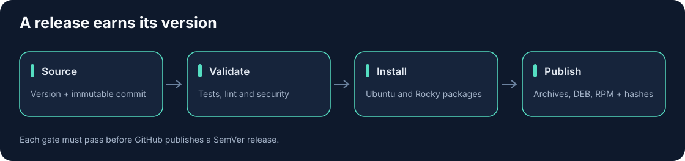

# Nagios Plugins Collection


[](https://github.com/somethingwithproof/nagios-plugins-collection/actions/workflows/ci.yml)
[](https://badge.fury.io/py/nagios-plugins-collection)
[](https://pypi.org/project/nagios-plugins-collection/)
[](https://opensource.org/licenses/MIT)
[](https://nagios-plugins-collection.readthedocs.io/en/latest/?badge=latest)
[](https://docs.astral.sh/ruff/)
[](https://github.com/PyCQA/bandit)

A modern, enterprise-grade collection of Nagios plugins for monitoring various systems.


## Features

- Modern Python: Requires Python 3.11+ with type hints and strict linting/typing (ruff, mypy)
- Async support where it matters (httpx, asyncio) for high fan‑out checks
- JSON output across plugins for easy ingestion
- Consistent CLI interface with common flags: `--timeout`, `--warning`, `--critical`, `--json`, `--verbose`
- Performance data (Nagios perfdata) standard across checks
- CI/CD with tests, coverage, SBOM generation, Trivy scanning, and cosign signing
- Kubernetes Helm chart and Nomad job provided for scheduled runs
- Security scanning with Bandit and pip-audit; pinned CI actions

## Available Plugins (modern set)

Note on legacy components: legacy standalone scripts were removed. Prefer the modern, typed plugins under `src/nagios_plugins/plugins/`. Install extras with `pip install "nagios-plugins-collection[all]"` or a subset (e.g., `[aws]`, `[k8s]`, `[pg]`, `[redis]`, `[prom]`, `[dns]`, `[es]`).

Core plugins:
- check_tls_expiry: Verify TLS certificate expiry and chain health
- check_dns_health: DNS resolution/NS health (dnspython optional)
- check_prometheus_query: Evaluate PromQL expressions and threshold results
- check_http_sli: Measure latency percentiles and error rate for an endpoint
- check_log_errors: Count error patterns via Elastic/OpenSearch HTTP
- check_k8s_node_status: Summarize Kubernetes node health (client optional)
- check_postgres_replication_lag: Lag in seconds via SQL (psycopg optional)
- check_queue_depth: AWS SQS queue depth/inflight (boto3 optional)
- check_redis_saturation: Redis memory/evictions/hitrates (redis-py)
- check_backup_freshness: Age of latest S3 object by prefix (boto3)
- check_cloud_budget: AWS Cost Explorer monthly spend (boto3)
- check_aws_cloudwatch: AWS CloudWatch metrics for EC2, RDS, Lambda, ELB (boto3 optional)
- check_oauth2_token: Validate token endpoint and scopes

## Installation

```bash
# Basic installation
pip install nagios-plugins-collection

# With development dependencies
pip install "nagios-plugins-collection[dev]"

# With security tools
pip install "nagios-plugins-collection[security]"

# With all extras
pip install "nagios-plugins-collection[all]"
```

## Quick Start

Example usage:

```bash
# Check Hadoop cluster
check_hadoop command --url=http://hadoop-master:8088/ws/v1/cluster/info

# Check MongoDB health
check_monghealth --host=mongodb.example.com --port=27017 --warning=80 --critical=90

# Check component status (example)
check_component_status --warning=75 --critical=90

# Check read-only mounts
check_ro_mounts --exclude=/proc,/sys,/dev

# Check website status
check_website_status --url=https://example.com --pattern="Welcome" --timeout=10

# Check AWS CloudWatch metrics
check_aws_cloudwatch \
  --namespace AWS/EC2 \
  --metric CPUUtilization \
  --instance-id i-1234567890abcdef0 \
  --warning 70 \
  --critical 90

# Check RDS database connections
check_aws_cloudwatch \
  --namespace AWS/RDS \
  --metric DatabaseConnections \
  --db-instance-id mydb-instance \
  --warning 50 \
  --critical 100

# Check Lambda function duration
check_aws_cloudwatch \
  --namespace AWS/Lambda \
  --metric Duration \
  --function-name my-function \
  --statistic Maximum \
  --warning 2000 \
  --critical 3000

# Get JSON output
check_website_status --url=https://example.com --pattern="Welcome" --timeout=10 --json
```

## Documentation

For full documentation, visit [nagios-plugins-collection.readthedocs.io](https://nagios-plugins-collection.readthedocs.io/).

## Install from the public repository

```bash
pip install 'git+https://github.com/somethingwithproof/nagios-plugins-collection.git'
```

Python distributions publish to PyPI or TestPyPI. Container images publish to
GitHub's Container registry after the main-branch checks pass.

## HTTPS verification

OAuth, Prometheus, HTTP SLI and log checks verify certificate trust and hostnames
by default. Use `--ca-file /path/to/private-ca.pem` for a private CA. The legacy
`--verify-ssl` option remains accepted; verification is always enabled.
HTTP SLI latency thresholds are in milliseconds; website thresholds are in seconds.

## Docker (end-to-end)

Build and run tests inside Docker:

```bash
docker build -f docker/Dockerfile -t nagios-plugins-collection:dev .
docker run --rm nagios-plugins-collection:dev
docker build --target tests -f docker/Dockerfile -t nagios-plugins-collection-tests:dev .
docker run --rm nagios-plugins-collection-tests:dev
```

Or with compose:

```bash
docker compose -f docker/docker-compose.yml run --build --rm tests
```

Run a plugin inside the container:

```bash
docker run --rm nagios-plugins-collection:dev check_website_status --url=https://example.com --pattern=Example
```

## Helm (Kubernetes)

General install:
```bash
helm upgrade --install npc charts/nagios-plugins-collection \
  --set image.repository=ghcr.io/somethingwithproof/nagios-plugins-collection \
  --set image.tag=latest \
  --set-json 'command=["check_http_sli","--url=https://example.com","--samples","5","--warning","200","--critical","500"]'
```

Examples per plugin (values overrides):

TLS expiry
```bash
helm upgrade --install tls charts/nagios-plugins-collection \
  --set-json 'command=["check_tls_expiry","--host","example.com","--port","443","--warning","14","--critical","7"]'
```

Prometheus query
```bash
helm upgrade --install prom charts/nagios-plugins-collection \
  --set-json 'command=["check_prometheus_query","--server","http://prometheus:9090","--query","sum(rate(http_requests_total[5m]))","--warning","100","--critical","200"]'
```

Kubernetes nodes
```bash
helm upgrade --install k8s charts/nagios-plugins-collection \
  --set serviceAccount.automountServiceAccountToken=true --set rbac.create=true \
  --set-json 'command=["check_k8s_node_status","--label","node-role.kubernetes.io/worker=true"]'
```

AWS S3 backup freshness
```bash
helm upgrade --install backup charts/nagios-plugins-collection \
  --set-json 'command=["check_backup_freshness","--bucket","my-bucket","--prefix","backups/","--warning","3600","--critical","7200"]' \
  --set env[0].name=AWS_REGION --set env[0].value=us-east-1
```

## Nomad

General job file ships at `deploy/nomad/nagios-plugins-collection.nomad.hcl`. Override args per plugin. Examples:

HTTP SLI
```hcl
args = ["check_http_sli","--url=https://example.com","--samples","5","--warning","200","--critical","500"]
```

TLS Expiry
```hcl
args = ["check_tls_expiry","--host","example.com","--port","443","--warning","14","--critical","7"]
```

## Publishing

You can publish releases via GitHub Actions (recommended) or locally with Twine. Never paste tokens in plaintext; use environment variables/secrets.

### GitHub Actions (one-click)

- Container publishing: validated main commits publish to GHCR with an SBOM and BuildKit provenance.
- Publish to PyPI: run "Publish to PyPI (manual)" and ensure the repo secret `PYPI_API_TOKEN` exists.
- Multi-destination: run "Publish Release (multi-destination)" and choose `pypi` or `testpypi`. You can also set `dry-run=true` to only build and run `twine check`.

Required secrets
- For PyPI: `PYPI_API_TOKEN` (scoped to the package, from https://pypi.org/manage/account/token/)
- For TestPyPI: `TESTPYPI_API_TOKEN` (from https://test.pypi.org)
- GHCR uses the built-in `GITHUB_TOKEN`.

### Local publish (manual)

Build and verify:

```bash
python -m pip install --upgrade build twine
python -m build
python -m twine check dist/*
```

Upload to TestPyPI:

```bash
export TWINE_USERNAME="__token__"
export TWINE_PASSWORD="{{TESTPYPI_API_TOKEN}}"
python -m twine upload --repository-url https://test.pypi.org/legacy/ dist/*
```

Upload to PyPI:

```bash
export TWINE_USERNAME="__token__"
export TWINE_PASSWORD="{{PYPI_API_TOKEN}}"
python -m twine upload dist/*
```

## Development

### Setting Up Development Environment

```bash
# Clone the repository
git clone https://github.com/somethingwithproof/nagios-plugins-collection.git
cd nagios-plugins-collection

# Create a virtual environment
python -m venv venv
source venv/bin/activate  # On Windows: venv\Scripts\activate

# Install development dependencies
pip install -e ".[dev,security]"
```

### Running Tests

```bash
# Run all tests
pytest

# Run with coverage
pytest --cov=src

# Run linting
tox -e lint

# Run type checking
tox -e type

# Run security checks
tox -e security
```

See the [Development Guide](https://nagios-plugins-collection.readthedocs.io/en/latest/development.html) for more information.

## Contributing

Contributions are welcome! See the [Contributing Guide](https://nagios-plugins-collection.readthedocs.io/en/latest/contributing.html) for more information.

## Releases and Linux packages

`pyproject.toml` is the source of the project version. Push a matching `v2.0.0`
tag on a tested main commit, or run the Release workflow on main with that
complete SemVer version. Publication reuses the entire CI workflow and installs
both native package formats before publishing a wheel, source archive, Helm chart, `.deb`,
`.rpm`, `release.json` and `SHA256SUMS` on the GitHub release. Public artifacts
receive GitHub build provenance attestations.

Verify downloaded artifacts with `sha256sum --check SHA256SUMS`. Install the
Debian package with `sudo apt install ./nagios-plugins-collection_2.0.0_all.deb`
on Ubuntu 24.04, or the RPM with
`sudo dnf install ./nagios-plugins-collection_2.0.0_noarch.rpm` on Rocky Linux 9.
Checks are installed under `/usr/lib/nagios/plugins`; their bundled Python
clients reside under `/usr/lib/nagios-plugins-collection`. PostgreSQL checks use
the system libpq. Native packages support Python 3.11+ on Debian and install
Python 3.12 on Rocky. Optional compiled accelerators are excluded from the
portable native payload; the container retains its platform-specific wheels.

Version 2 migration: HTTP checks now verify peer certificates by default.
Use `--ca-file` for a private CA; `--verify-ssl` remains accepted but no longer
disables verification when omitted. Python callers of `execute_command_async`
and `check_http_endpoint_async` must wrap calls in `asyncio.timeout(seconds)`
instead of passing a `timeout` argument. Cancellation kills and reaps subprocess
children. CLI `--timeout` behavior is preserved. HTTP SLI latency thresholds are
milliseconds; website-status thresholds are seconds.

## License

This project is licensed under the MIT License - see the [LICENSE](LICENSE) file for details.


