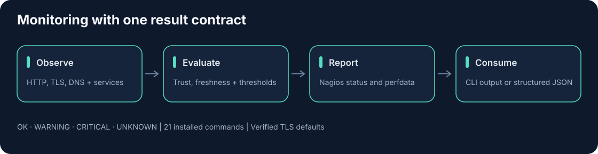

Nagios Plugins Collection
=========================

Twenty-one monitoring commands share Nagios status, performance data and JSON
results. Maintained Python runtimes, verified HTTP/TLS defaults and real service
contracts form the release baseline.

.. toctree::
   :maxdepth: 2
   :caption: Contents:

   introduction
   installation
   usage
   plugins/index
   api/index
   development
   releasing
   contributing
   changelog

Indices and tables
------------------

* :ref:`genindex`
* :ref:`modindex`
* :ref:`search`
